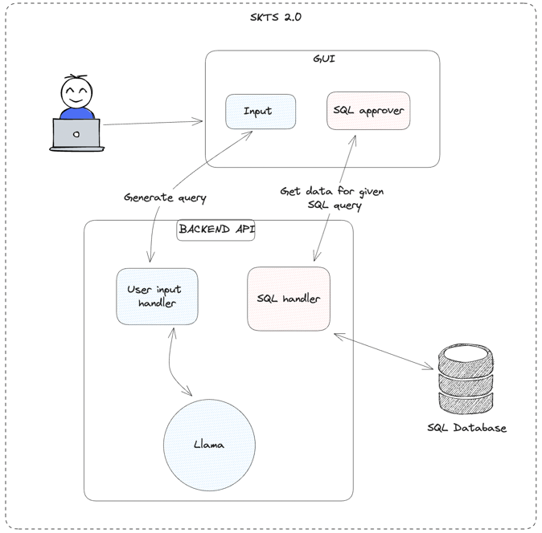

# skts-talk-to-your-data

Talk to your data - HackYeah 2023 project

Application for Natural Language -> SQL translating + database operations at once

## Environment setup

- ``git clone <repo>``
- [Install Python3.10]
- pip install -r requirements.txt

## Database setup

Project is prepared to use multiple databases (chosen by the user). To setup new database follow these steps:

- generate and fill database
- save in the `db/` directory (`{name}.db`)
- save ddl file (CREATE, UPDATE queries) in the single file inside `db/ddl/` in format `{name}.ddl`

## LLM model installation

- download your llama model and save directory on base level of project's structure as directory named: `llama`

## Dockerization

- with installed databases and llama, build the docker image with prepared `Dockerfile`

## High level Architecture

