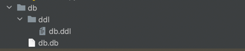

# skts-talk-to-your-data

Talk to your data - HackYeah 2023 project

Application for Natural Language -> SQL translating + database operations at once

## Environment setup

- ``git clone <repo>``
- [Install Python3.10]
- pip install -r requirements.txt

## Database setup

Project is prepared to use multiple databases (chosen by the user). To setup new database follow these steps:

- generate and fill database
- save in the `db/` directory (`{name}.db`)
- save ddl file (CREATE, UPDATE queries) in the single file inside `db/ddl/` in format `{name}.ddl`

How the directory structure should look like:

## LLM model installation

The most important aspect in this project is the LLM Llama 2 model. To run service locally (or dockerize and push to the vm). SKTS project prepared easy pluging-in the LLM model inside the project structure. Here is the few steps instruction:
- download your llama model
- save whole directory on the base level of the project in directory named `llama`.

SKTS prepared initialization of the language model, there is only need to put the model inside the project structure.

How the directory structure should look like:

Llama SKTS flow:

## Dockerization

- with installed databases and llama, build the docker image by running `docker build` with prepared `Dockerfile`

## API definition

API definition is generated with OpenAPI technology. `openapi.yaml`

`sql/query` example:

`sql/data` example:

## High level Architecture

